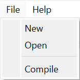
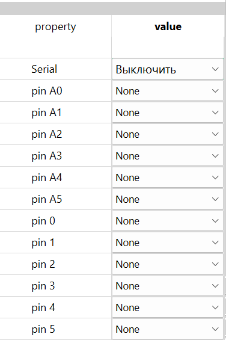
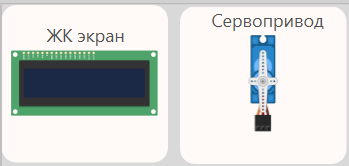

# Quick guide for TrueIDE

---
# Quick start
To create or open a project, click the buttons `File → New` or `File → Open` in the menu bar.

# Project properties
To configure the project properties you need to change the values in the `Properties` tab in the lower left corner.

# Components
To add components to your project, click on the desired components on the right side of the workspace.

___
# Authors
Quick guide by @Patysonchick

Backend by @chebur5581

> Good luck ;)